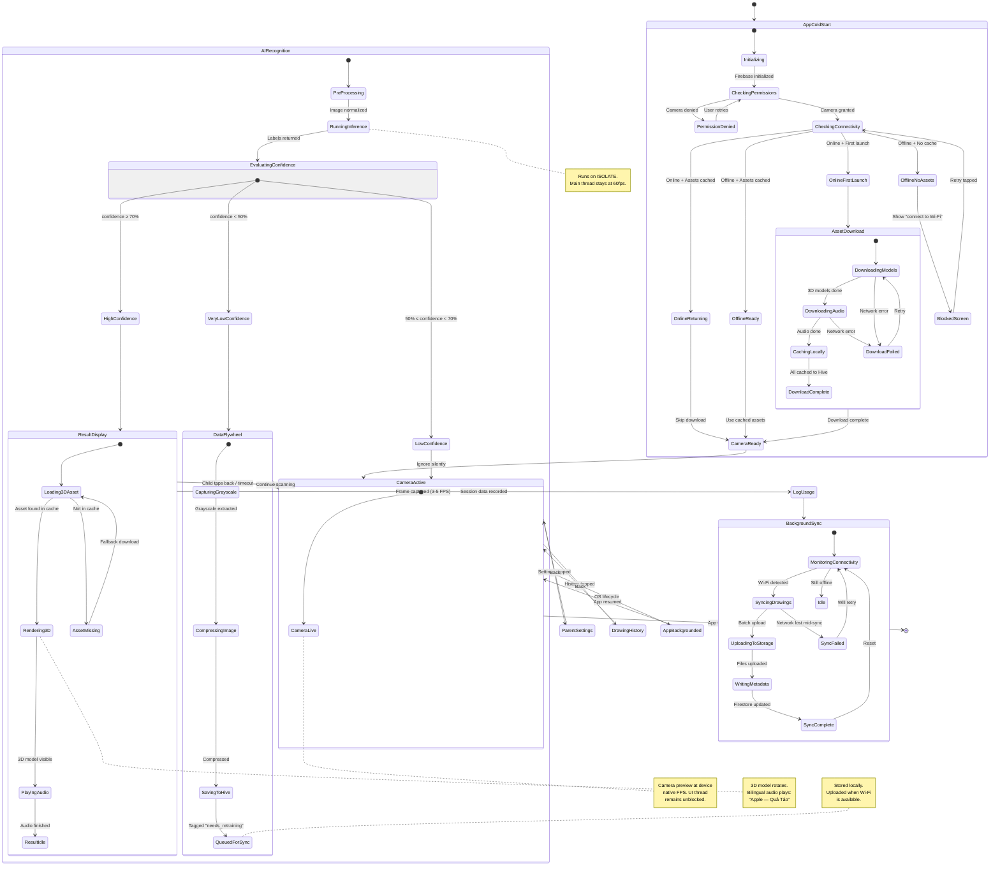
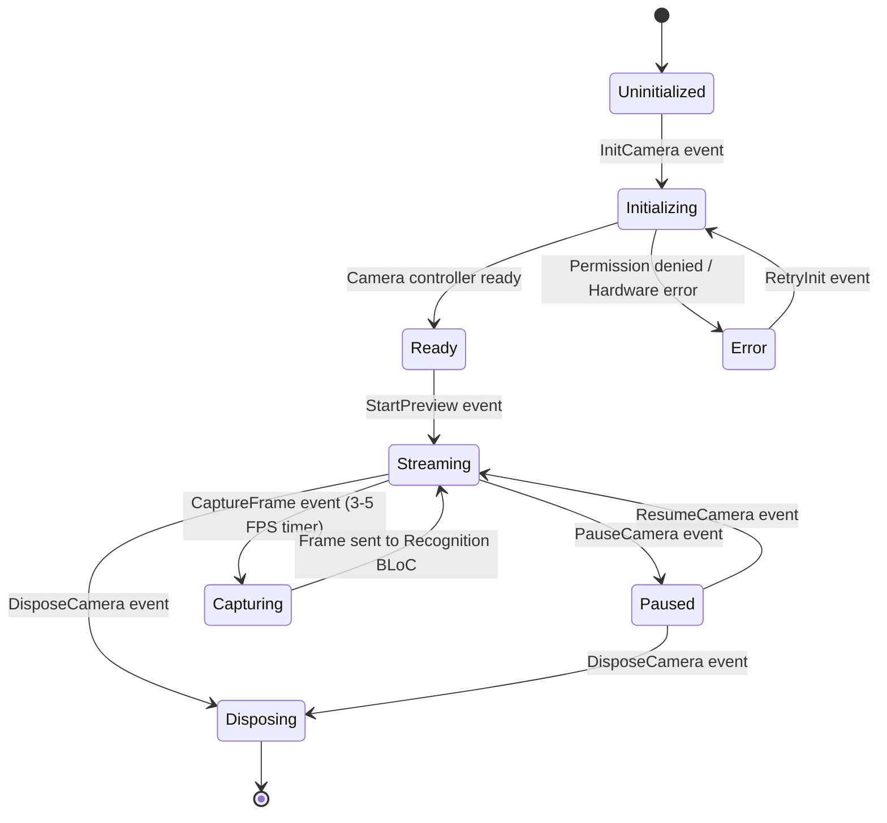
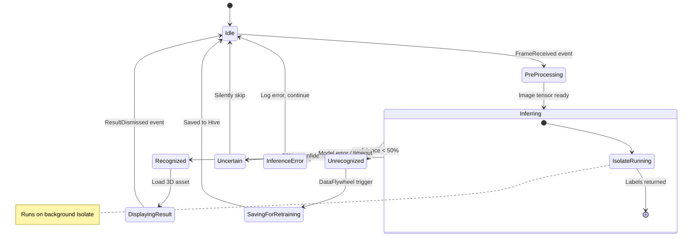
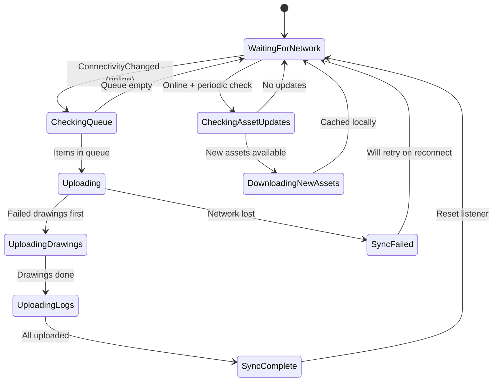

# Magic Doodle — State Machine

> All application states, transitions, and edge cases mapped to the Core User Flow from `spec.md`.

---

## 1. Application Lifecycle State Machine

---

## 2. Camera BLoC State Machine

---

## 3. Recognition BLoC State Machine

---

## 4. Sync BLoC State Machine

---

## 5. State Transition Summary Table

| From State           | Event / Trigger              | To State              | Side Effect                                |
| -------------------- | ---------------------------- | --------------------- | ------------------------------------------ |
| `AppColdStart`       | Firebase init done           | `CheckingPermissions` | Request camera permission                  |
| `CheckingConnectivity` | Online + first launch      | `AssetDownload`       | Begin downloading 3D models + audio        |
| `CameraLive`         | Timer tick (3-5 FPS)         | `PreProcessing`       | Capture frame, send to Isolate             |
| `Inferring`          | confidence ≥ 70%             | `Recognized`          | Fetch cached 3D asset                      |
| `Inferring`          | confidence < 50%             | `DataFlywheel`        | Save grayscale to Hive, tag for retraining |
| `Recognized`         | Asset loaded                 | `DisplayingResult`    | Render 3D model, play bilingual audio      |
| `DisplayingResult`   | Timeout / tap                | `CameraLive`          | Log usage session                          |
| `WaitingForNetwork`  | Wi-Fi connected              | `Uploading`           | Batch upload queued drawings               |
| `SyncComplete`       | All items uploaded           | `WaitingForNetwork`   | Reset queue, update Firestore metadata     |

---

## 6. Error Recovery Matrix

| Error Scenario              | Detection               | Recovery Strategy                                     |
| --------------------------- | ----------------------- | ----------------------------------------------------- |
| Camera permission denied    | OS callback             | Show friendly prompt, deep-link to Settings           |
| TFLite model load failure   | Exception in ModelLoader | Retry 3x → show "restart app" message                |
| Isolate crash during inference | Isolate error port   | Restart Isolate, skip current frame                   |
| Network lost during sync    | Connectivity stream     | Pause upload, re-queue items, retry on reconnect      |
| Hive DB corruption          | HiveError catch         | Clear corrupted box, re-download assets on next Wi-Fi |
| 3D asset missing from cache | FileNotFound exception  | Fall back to placeholder model, queue download        |
| Firebase quota exceeded     | FirebaseException       | Exponential backoff, alert parent via Settings        |
